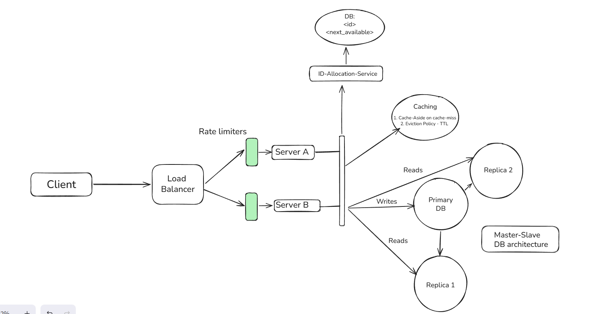

# URL Shortener

A scalable URL shortening service built with Node.js, TypeScript, Express, MySQL, Redis, and Docker.

The system is designed around high read traffic, efficient short-code generation, caching, database persistence, and separation of concerns between URL serving and ID allocation.

## Features

* Create short URLs from long URLs
* Retrieve original URLs using short codes
* Configurable URL expiration
* Default URL expiration of 365 days
* Short-code generation using Base62 encoding
* Distributed ID allocation using a dedicated ID allocation service
* Redis caching for frequently accessed URLs
* MySQL as the persistent data store
* Database migrations using Drizzle ORM
* Docker Compose based local deployment
* Health checks for dependent services
* Separate migration and seed execution
* Service-to-service communication through Docker's internal network

# System Requirements

## Functional Requirements

The system should:

- Convert long URLs to short URLs
	- Optionally, user can provide custom alias
	- Optionally, user can set expiration time
- Redirect to the original URL from short URL.

### ID Allocation

The system should:

1. Maintain a monotonically increasing ID sequence.
2. Allocate IDs in ranges instead of requesting one ID for every URL.
3. Allow application servers to consume IDs locally.
4. Allocate another range when the current range is exhausted.
5. Prevent multiple allocation requests from modifying the sequence incorrectly(using rangePromise).

---

# Non-Functional Requirements

### Scalability

The system should support a large number of URL creation and read requests.

Reads are expected to significantly outnumber writes, therefore the architecture prioritizes efficient reads through Redis caching and database indexing.

### Availability

URL retrieval should remain highly available whenever possible.

Redis provides a fast read path while MySQL remains the persistent source of truth.

### Consistency

URL creation must be durable before the request is considered successful.

The database is treated as the source of truth for URL mappings.

### Performance

Frequently accessed URLs should be served from Redis without requiring a database query.

ID ranges are allocated in batches to reduce database contention and network overhead.

### Durability

URL mappings are persisted in MySQL.

Redis is treated as a cache rather than the permanent source of data.

### Fault Isolation

The ID allocation service is separated from the main backend so that ID generation does not have to be implemented directly inside every application instance.

---

# Architecture

The system consists of the following major components:



---
# Services

Technology:

* Node.js
* TypeScript
* Express
* Drizzle ORM
* MySQL
* Redis
* Axios

## ID Allocation Service

The ID allocation service is responsible for generating unique numeric IDs.
Instead of making the backend request a new ID for every URL, the service allocates a range:
    - Example: `100000 - 109999`

The backend can then consume these IDs locally.
When the range is exhausted, another range is requested.

This reduces:

* Database writes
* Network requests
* Lock contention
* Latency during URL creation

The system uses numeric IDs internally and converts them into Base62 using a custom BASE 62 class with encode() and decode() static methods.

---
# Data Model

## URLs

The main URL table contains:

| Column        | Description                  |
| ------------- | ---------------------------- |
| `shortId`     | Unique Base62 short code     |
| `originalUrl` | Original destination URL     |
| `userId`      | User associated with the URL |
| `createdAt`   | URL creation timestamp       |
| `expiredAt`   | URL expiration timestamp     |

`shortId` is indexed through its primary-key constraint, allowing efficient lookup.

## Allocations

### Table: Allocation
### Database: ranges

| Column         | Description                          |
| -------------  | -----------------------------------  |
| `id`           | Points to row number(always 1)       |
|`next_available`| stores the next available numeric ID.|

The ID allocator updates this value transactionally when allocating a new range.

---
# API

## Create Short URL

### Request

```http
POST /api/v1/urls
Content-Type: application/json
{
    "original_url": "https://developer.mozilla.org/en-US/docs/Web/JavaScript/Reference",
    "expiry_days":"100"
}
```

If expiry is not provided, the URL expires after 365 days.
The maximum supported expiration period is 365 days.

### Response

```
{
    "statusCode": 201,
    "message": "Short Url created successfully",
    "data": {
        "short_id": "ciKbTd3",
        "short_url": "http://localhost:5000/ciKbTd3",
        "original_url": "https://developer.mozilla.org/en-US/docs/Web/JavaScript/Reference"
    },
    "success": true
}
```

# Retrieve URL

### Request

```http
GET /api/v1/urls/:
```

### Response

```302 Redirect (Redirected to the original url)```

---
# Docker

The project uses Docker Compose to run the complete development environment.

Example services include:

```
mysql-primary
mysql-id-allocation
redis
migration-primary
migration-id-allocation
id-allocator
backend
```

## Build and Start

```bash
docker compose up --build
```

## Stop Services

```bash
docker compose down
```

---
## Health Checks

For example:

- MySQL can be checked using:

```yaml
healthcheck:
  test: ["CMD", "mysqladmin", "ping", "-h", "localhost", "-u", "root", "-p${WRITE_ROOT_PASSWORD}"]
  interval: 10s
  timeout: 5s
  retries: 5
```
- HTTP Servers can be checked using
```yaml
healthcheck:
    test: ["CMD", "node", "-e", 
    "require('http')
        .get('http://localhost:8000/health', r => process.exit(r.statusCode === 200 ? 0 : 1))
        .on('error', () => process.exit(1))"]
    interval: 10s
    timeout: 5s
    retries: 5
```

The ID allocation service exposes:

```http
GET /health
```

which can be used by Docker to determine whether the service is ready.

# Project Structure

A simplified project structure:

```text
URL-SHORTENER/
├── backend/
│   ├── dist/
│   ├── src/
│   │   ├── database/
│   │   ├── drizzle/
│   │   ├── helpers/
│   │   ├── redis/
│   │   ├── services/
│   │   ├── types/
│   │   ├── utils/
│   │   ├── app.ts
│   │   ├── base62.ts
│   │   └── controller.ts
│   ├── .env
│   ├── Dockerfile
│   ├── drizzle.config.ts
│   ├── package-lock.json
│   ├── package.json
│   └── tsconfig.json
│
├── id-allocation-service/
│   ├── dist/
│   ├── src/
│   ├── .env
│   ├── Dockerfile
│   ├── drizzle.config.ts
│   ├── package-lock.json
│   ├── package.json
│   └── tsconfig.json
│
├── .env
├── .env.example
├── .gitignore
├── docker-compose.yaml
└── README.md
```

---

# Installation

### Prerequisites

Install:

* Node.js
* npm
* Docker
* Docker Compose

### Clone

```bash
git clone <repository-url>
cd URL-Shortener
```

### Configure Environment
Create the required `.env` files.

ID allocation service:

### Install & Run

```bash
cd id-allocation-service
npm install
npm run dev
```

Backend:

```bash
cd backend
npm install
npm run dev
```

Ensure MySQL and Redis are available and the corresponding environment variables are configured.

---
## Run with Docker

From the project root:

```bash
docker compose up --build
```
